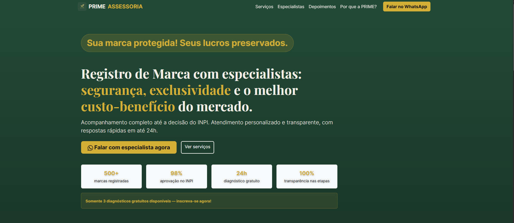
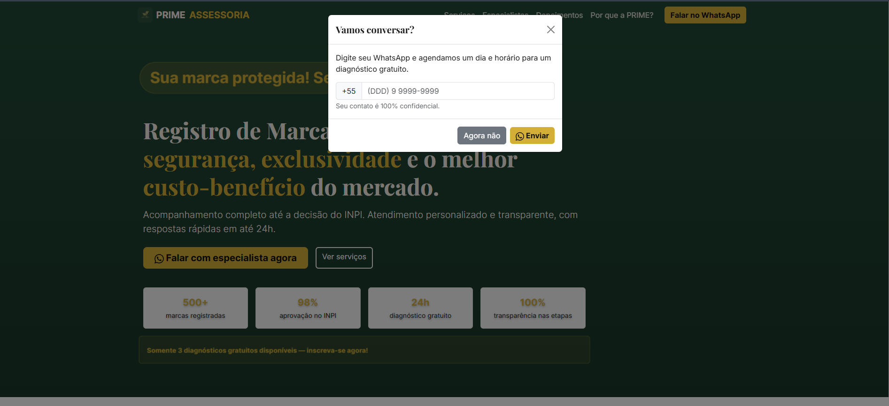
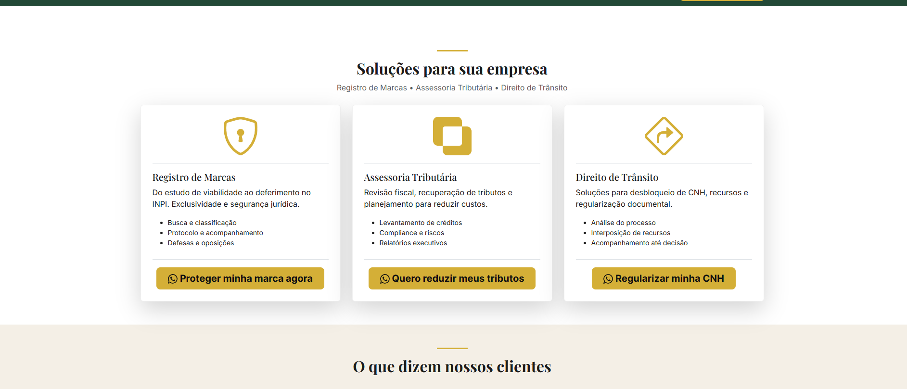
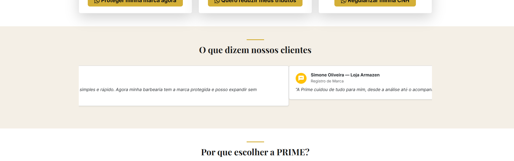
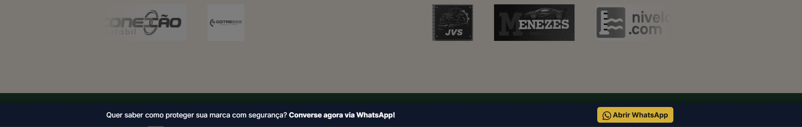

# Prime Assessoria — Landing Page (Case Study)  
[](#)
[](#)
[](#)
[](#)
[](#)
[](#)
[](#)
[](#)

<!-- Substitua os scores após rodar o Lighthouse no seu deploy -->
[](#)
[](#)
[](#)
[](#)

**Live Preview:** https://prime-assessoria.netlify.app/  
**Backup Preview (GitHub Pages):** https://github.com/AldomarAssolin/prime-page.git  
**(Opcional) Relatório Lighthouse:** https://pagespeed.web.dev/analysis?url=https%3A%2F%2Flively-wisp-a7b5a8.netlify.app%2F

> Este case reúne **UX + front-end** para conversão, direcionado a **Registro de Marca**, **Assessoria Tributária** e **Direito de Trânsito**.  
> Foco em credibilidade (estatísticas, especialistas, prova social), contato rápido (WhatsApp) e linguagem clara (sem promessas de reembolso).

---

## 🎯 Objetivos do projeto
- **Gerar leads qualificados** com CTAs claros e baixa fricção (sticky bar + FAB + pop-up leve).
- **Reforçar credibilidade** (500+ marcas, 98% aprovação no INPI, acompanhamento até a decisão, transparência).
- **Separar serviços** com arquitetura de informação clara e ícones dedicados.
- **Ajustar copy**: remover “dinheiro de volta” e adotar mensagens de confiança.

---

## 🛠️ Entregas (Highlights)
- **Hero/Headline**: “**Registro de Marca com especialistas: segurança, exclusividade e o melhor custo-benefício do mercado.**”
- **Três serviços** bem separados (ícones + benefits + CTA específico por serviço).
- **Especialistas** logo acima (humanização com foto + credenciais).
- **Prova social** em carrossel de depoimentos (fictícios sinalizados).
- **Sticky bar de WhatsApp** + **FAB mobile** + **pop-up** (captura de WhatsApp).
- **A11y & SEO**: headings semânticos, aria, contraste, Open Graph/Twitter, JSON-LD.
- **Performance**: lazy-loading de imagens, preload/preconnect de fontes, dependências enxutas.

---

## 🧰 Stack
**HTML5**, **CSS (Bootstrap 5.3)**, **JavaScript (vanilla)**, **Bootstrap Icons**, **Google Fonts (Playfair Display, Inter)**.

---

## 🧩 Estrutura das seções
1. Navbar (Serviços, Especialistas, Depoimentos, Por que a PRIME)  
2. Hero (headline + credenciais + CTA)  
3. Especialistas (humanização)  
4. Serviços (3 cartões com ícones/CTAs)  
5. Depoimentos (carrossel)  
6. Por que a PRIME? (blocos com ícones)  
7. CTA final  
8. Footer  
9. Sticky WhatsApp Bar + FAB mobile + Modal pop-up

---

## 📲 Integração WhatsApp
- **Sanitização** de número (qualquer formato → `55DDDNÚMERO`).  
- **Fallback automático** para `api.whatsapp.com` se `wa.me` não abrir.  
- **Mensagens por contexto** (padrão, tributos, marcas, trânsito).  
- **UTM opcional** para analytics.

> **Config rápida**: edite `RAW_WHATSAPP_NUMBER`, `msgs` e `UTM` no script principal.

---

## ♿ Acessibilidade (Checklist)
- Hierarquia de headings consistente (`h1` no hero, `h2` nas seções).  
- `aria-label` em botões/links críticos; ícones `aria-hidden="true"`.  
- Contraste adequado nos CTAs e sticky bar.  
- Carrossel e modal navegáveis via teclado.

---

## 🔎 SEO (Checklist)
- `title` e `meta description` informativos.  
- `link rel="canonical"`.  
- Open Graph/Twitter Card.  
- **Schema.org/JSON-LD** (`ProfessionalService` + serviços/telefone).

---

## ▶️ Rodando localmente
```bash
git clone https://github.com/seu-usuario/prime-assessoria-landing.git
cd prime-assessoria-landing
# abrir index.html no navegador
# ou usar a extensão Live Server (VS Code) para auto-reload

```

## 👨🏻‍💻 Autor

### Aldomar “Manex” Assolin — Full Stack & Product-minded

- [@aldomarassolin](https://www.github.com/AldomarAssolin)

## 🔗 Links
[](https://aldomarassolin-dev-php.vercel.app/)
[](https://www.linkedin.com/in/aldomarassolinn)

> Email: [assolinaldomar@gmail.com](mailto:assolinaldomar@gmail.com)

 ## Screenshots









